# SORT X — Ordenação Genérica e Resolução de Problemas (Spring Boot + JavaFX)

## Visão Geral
O **sortX** é uma aplicação desktop em **Java** que integra **Spring Boot** (injeção de dependências) e **JavaFX** (UI).  

Objetivos:
1) **Ordenar CSVs** com múltiplos algoritmos, tanto em **memória primária (RAM)** quanto **in-place** na **memória secundária (disco)**.  
2) **Resolver problemas clássicos** (Mochila) via **Programação Dinâmica**, **Divisão e Conquista** e **Guloso**, com análise e gráficos.

---

## Mapas Visuais

### Arquitetura Geral


[//]: # (```mermaid)

[//]: # (flowchart LR)

[//]: # (  subgraph UI[JavaFX UI])

[//]: # (    A[MainUI] --> B[RuleEditorPane])

[//]: # (    A --> C[ChartsPane])

[//]: # (  end)

[//]: # ()
[//]: # (  subgraph Core[Camada Core])

[//]: # (    D[ParserRegistry] -->|CSV| E[CsvDataParser])

[//]: # (    F[SortStrategyRegistry] --> F1[QuickSort])

[//]: # (    F --> F2[MergeSort])

[//]: # (    F --> F3[BubbleSort])

[//]: # (    F --> F4[SelectionSort])

[//]: # (    G[SortingService] --> F)

[//]: # (    H[StatsService])

[//]: # (  end)

[//]: # ()
[//]: # (  I[InPlaceCsvSorter &#40;INDEX/RUNS&#41;])

[//]: # ()
[//]: # (  UI --> D)

[//]: # (  UI --> G)

[//]: # (  UI --> H)

[//]: # (  UI --> I)

[//]: # (```)

### Modos de Ordenação


[//]: # (```mermaid)

[//]: # (flowchart TD)

[//]: # (  start&#40;[Escolher Modo]&#41; --> ram{Na memória?})

[//]: # (  ram -- Sim --> RAM[Carregar CSV em RAM<br/>List<DataRecord>])

[//]: # (  RAM --> Algo[Aplicar Algoritmo escolhido])

[//]: # (  Algo --> Atualiza[Atualiza UI/Gráficos])

[//]: # ()
[//]: # (  ram -- Não &#40;In-place&#41; --> ext{Modo externo})

[//]: # (  ext -- INDEX --> IDX[Gerar .idx &#40;offset,length&#41; por linha])

[//]: # (  IDX --> SortIdx[Ordenar .idx no disco<br/>&#40;Quick/Merge/Bubble/Selection&#41;])

[//]: # (  SortIdx --> Rewrite[Regravar CSV segundo .idx])

[//]: # (  Rewrite --> Atualiza)

[//]: # ()
[//]: # (  ext -- RUNS --> Runs1[Ler arquivo em blocos])

[//]: # (  Runs1 --> Runs2[Ordenar bloco &#40;algoritmo&#41;])

[//]: # (  Runs2 --> Runs3[Salvar como run temporário])

[//]: # (  Runs3 --> Kmerge[Merge k-vias dos runs])

[//]: # (  Kmerge --> Reescreve[Gerar CSV final])

[//]: # (  Reescreve --> Atualiza)

[//]: # (```)

### Problema da Mochila


[//]: # (```mermaid)

[//]: # (flowchart LR)

[//]: # (  ICSV[CSV item,peso,valor] --> Detect[Detectar colunas / capacidade])

[//]: # (  Detect --> Escolha{Algoritmo})

[//]: # (  Escolha -- DP --> DP[Preencher tabela dp[i][c]])

[//]: # (  Escolha -- D&C --> DC[Recursão + memoização])

[//]: # (  Escolha -- Guloso --> Greedy[Ordenar por valor/peso e selecionar])

[//]: # (  DP --> Result[Itens escolhidos + totais + gráficos])

[//]: # (  DC --> Result)

[//]: # (  Greedy --> Result)

[//]: # (```)

---

## Funcionalidades
- Importar **CSV** e visualizar em tabela.
- Regras de ordenação com **prioridade (thenComparing)**, **ordem** e **case-insensitive**.
- Algoritmos: **QuickSort**, **MergeSort**, **BubbleSort**, **SelectionSort**.
- Modos: **RAM** e **In-place (INDEX/RUNS)**.
- Estatísticas e gráficos (frequências, séries numéricas).
- Mochila: **DP**, **Divisão & Conquista**, **Guloso**; exportação do resultado.
- Substituição segura de arquivo com **ATOMIC_MOVE**.

---

## Estrutura de Pacotes
- `sortx` — bootstrap Spring + JavaFX (`SortXSpringBoot`, `AppLauncher`).
- `sortx.ui` — UI JavaFX (`MainUI`, `RuleEditorPane`, `ChartsPane`, `InPlaceCsvSorter`).
- `sortx.core.data` — `DataSet`, `DataRecord`.
- `sortx.core.data.parser` — `ParserRegistry`, `CsvDataParser`.
- `sortx.core.rules` — `RuleSet`, `SortRule`, `ComparatorFactory`, `TypeInference`, `enums`.
- `sortx.core.sort` — `SortStrategy` + `implementações`.
- `sortx.core.service` — `SortingService`.
- `sortx.core.stats` — `StatsService`.

---

## Execução

### Requisitos
- **Java 17+**
- **Maven**

### Build & Run
```bash
mvn clean package
java -jar target/sortx-1.0.0.jar
```

### Flags úteis
- `-Dsortx.externalMode=INDEX` (padrão) ou `RUNS`
- `-Dsortx.maxRowsInMemory=50000` (RUNS)
- `-Dsortx.maxLineBytes=1048576` (INDEX)

Exemplo:
```bash
java -Dsortx.externalMode=RUNS -Dsortx.maxRowsInMemory=25000 -jar target/sortx-1.0.0.jar
```

---

## UI (JavaFX)
- **Top Bar**: Importar, Algoritmo, Modo (RAM/Disco), Submodo Externo (INDEX/RUNS), Ordenar/Resolver.
- **Aba Tabela**: dados e cabeçalho detectado.
- **Aba Regras**: colunas, ordem, case-insensitive; múltiplas regras com prioridade.
- **Aba Gráficos**: frequências (barras) e série numérica (linha).
- **Aba Problemas**: configurar capacidade e algoritmo (DP/D&C/Guloso).
- **Aba Resolução**: itens escolhidos, totais e gráficos (pizza).

---

## Notas de Projeto
- **INDEX** evita N arquivos temporários (apenas `.idx` + auxiliar), usa buffers pequenos.
- **RUNS** usa blocos em RAM controlados e merge k-vias, ideal para datasets muito grandes.
- Ordenações O(n²) (Bubble/Selection) foram implementadas no INDEX por completude/didática.
- Substituição de arquivo via **ATOMIC_MOVE** quando suportado.

---

## Troubleshooting
- CSVs com **quebras de linha dentro de campos** exigem indexador *CSV-aware*. O INDEX atual assume uma linha por registro.
---

## Como rodar com configurações
```bash
java   -Dsortx.externalMode=INDEX   -Dsortx.maxLineBytes=1048576   -Dsortx.maxRowsInMemory=50000   -jar target/sortx-1.0.0.jar
```
